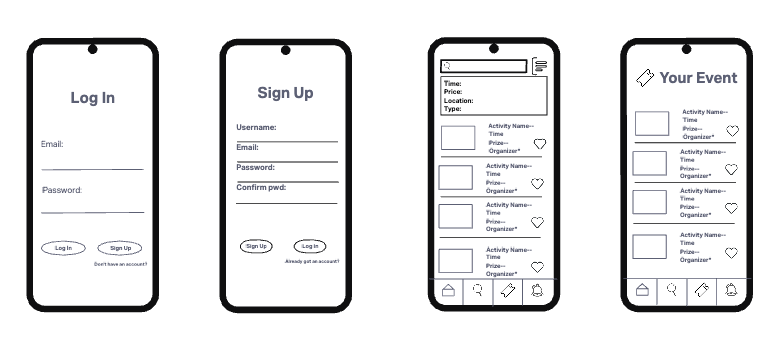
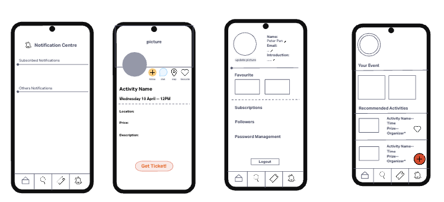

# G7

## Team Meeting 1- Week 7 - April 10th - 13:00 - 17:00

**Absent:**
None
**Lead/scribe:**Zhiyuan Lu (u7690985)

## Agreed Procedure

Before this meeting, everyone should at least briefly read the requirements of this group project.

Stand up Procedure: 

- Each team member shares their ideas on what theme/topic our APP should be.
- Discuss what custom features are related to our APP, as well as how many custom features we need to implement.
- Sketch a simple UI layout
- Briefly discuss how we plan to implement the requirements for Part 1: Basic APP
- Discuss each member's role, as well as each member's task in this week.

## Agenda Items

| Number |                         Item |
| :----- | ---------------------------: |
| [1]    |  Decide the theme of the APP |
| [2]    | Decide the extended features |
| [3]    |                    UI sketch |
| [4]    |  Assign tasks. specify roles |

## Meeting Minutes

- We decide to design a charity event APP(like Eventbrite), which is addressing the 17 goals of SDGs of "Make cities inclusive, safe, resilient and sustainable". Some events may bring diverse people together to foster inclusivity, some events like raise funds to police and firefighters would make the city safer…We think this APP is not just a tool for event management, but a platform for social change and community improvement.

- For extended features, we decide to do the following:

  - Data-Profile -  Create a profile page for Users.

  - Data-GPS - To search the events within given range. i.e. from 5km - 10km

  - Data-Deletion - Delete a node from AVL Tree

  - FB-Auth - Login/Sign up users

  - FB-Persist

  - P2P-DM

  - Interact-Follow

    Extra features if time is permitted: 1. Integrate a recommended system to suggest related events that the user might be interested with. 2. Integrate a GAN model that can generate user's avatar.

- The sketched UI layouts are shown below:

  

  

- Roles:

  - Zhiyuan Lu, Tengkai Wang - work on databases
  - Xuan Li, Qianwen Shen - Work on information processing and interface interactions
  - Haolin Li - Searching Algorithms (include tokenizer and parser)
  
- Design pattern to use:

  - Singleton - use in Firestore database
  - Observer - use in organizer publishes notifications to followers.
  - Iterator: Iterate events information

## Project Plan

**week7**

- Get the required events data set 
- Use Firestore to save events info and user info
- UI sketch and layout design
- Complete the function of sign-in, sign-up
- Layout of the main page

**week8**

- create user profile page
- implement search function by using tokenizer and parser
- implement GPS location
- AVL tree implement and integrate with database
- Event add, delete and show on main page

**week9**

- Layout of notification page
- Implement the P2P-DM function
- Implement the Interact-Follow function

**week10**

- Implement the FB-Persist function
- Junit test

**Week11**

- Documentation and presentation 

## UML Diagram

## Action Items

| Task                                     |       Assigned To       |  Due Date  |
| :--------------------------------------- | :---------------------: | :--------: |
| scrape 2500 events info                  |  Tengkai Wang, Xuan Li  | April 19th |
| UI sketch and layout design, sign-in, sign-up | Haolin Li, Qianwen Shen | April 19th |
| Use firestore to save events info and user info |       Zhiyuan Lu        | April 19th |

## Scribe Rotation

The following dictates who will scribe in this and the next meeting.

|     Name     |
| :----------: |
|  Zhiyuan Lu  |
| Tengkai Wang |
|  Haolin Li   |
| Qianwen Shen |