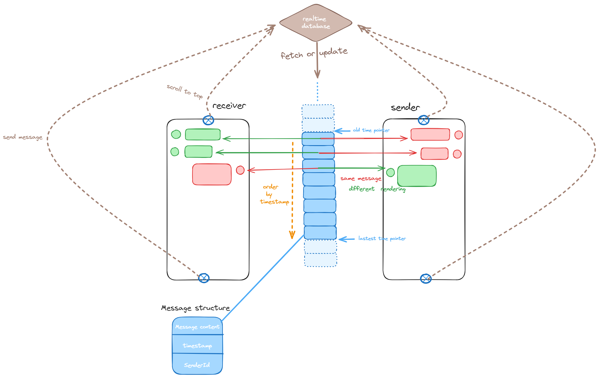

# [G7 - G7777777] Report

The following is a report template to help your team successfully provide all the details necessary for your report in a structured and organised manner. Please give a straightforward and concise report that best demonstrates your project. Note that a good report will give a better impression of your project to the reviewers.

Note that you should have removed ALL TEMPLATE/INSTRUCTION textes in your submission (like the current sentence), otherwise it hampers the professionality in your documentation.

*Here are some tips to write a good report:*

* `Bullet points` are allowed and strongly encouraged for this report. Try to summarise and list the highlights of your project (rather than give long paragraphs).*

* *Try to create `diagrams` for parts that could greatly benefit from it.*

* *Try to make your report `well structured`, which is easier for the reviewers to capture the necessary information.*

*We give instructions enclosed in square brackets [...] and examples for each sections to demonstrate what are expected for your project report. Note that they only provide part of the skeleton and your description should be more content-rich. Quick references about markdown by [CommonMark](https://commonmark.org/help/)*

## Table of Contents

1. [Team Members and Roles](#team-members-and-roles)
2. [Summary of Individual Contributions](#summary-of-individual-contributions)
3. [Application Description](#application-description)
4. [Application UML](#application-uml)
5. [Application Design and Decisions](#application-design-and-decisions)
6. [Summary of Known Errors and Bugs](#summary-of-known-errors-and-bugs)
7. [Testing Summary](#testing-summary)
8. [Implemented Features](#implemented-features)
9. [Team Meetings](#team-meetings)
10. [Conflict Resolution Protocol](#conflict-resolution-protocol)

## Administrative
- Firebase Repository Link: <insert-link-to-firebase-repository>
   - Confirm: I have already added comp21006442@gmail.com as a Developer to the Firebase project prior to due date.
- Two user accounts for markers' access are usable on the app's APK (do not change the username and password unless there are exceptional circumstances. Note that they are not real e-mail addresses in use):
   - Username: comp2100@anu.edu.au	Password: comp2100
     - Username: comp6442@anu.edu.auPassword: comp6442

## Team Members and Roles
The key area(s) of responsibilities for each member

| UID      |     Name     |                        Role |
| :------- | :----------: | --------------------------: |
| u7690985 |  Zhiyuan Lu  |              Project Leader |
| u7733280 | Tengkai Wang |      Android Developer(API) |
| u7709518 |   Xuan Li    |  Android Developer(Backend) |
| u7726387 | Qianwen Shen | Android Developer(Frontend) |
| u7772332 |  Haolin Li   |  Android Developer(Backend) |

## Summary of Individual Contributions

Specific details of individual contribution of each member to the project.

Each team member is responsible for writing **their own subsection**.

A generic summary will not be acceptable and may result in a significant lose of marks.

*[Summarise the contributions made by each member to the project, e.g. code implementation, code design, UI design, report writing, etc.]*

*[Code Implementation. Which features did you implement? Which classes or methods was each member involved in? Provide an approximate proportion in pecentage of the contribution of each member to the whole code implementation, e.g. 30%.]*

*you should ALSO provide links to the specified classes and/or functions*
Note that the core criteria of contribution is based on `code contribution` (the technical developing of the App).

*Here is an example: (Note that you should remove the entire section (e.g. "others") if it is not applicable)*

1. **u7772332, Haolin Li**  I have 20% contribution, as follows:  
  - **Code Contribution in the final App**
    - [Search]
     * [SearchActivity.java](https://gitlab.cecs.anu.edu.au/comp2100/group-project/ga-23s2/-/blob/main/items/media/_examples/Dummy.java)
     * [EventDataManager.java](https://gitlab.cecs.anu.edu.au/u7690985/gp-24s1/-/blob/main/HumanitarianApp/app/src/main/java/com/example/ievent/database/data_manager/EventDataManager.java?ref_type=heads)
    - [Search-Filter]
     * [SearchActivity.java](https://gitlab.cecs.anu.edu.au/comp2100/group-project/ga-23s2/-/blob/main/items/media/_examples/Dummy.java)
    - [Tokenizer and Parser] 
      * [Token.java](https://gitlab.cecs.anu.edu.au/u7690985/gp-24s1/-/blob/main/HumanitarianApp/app/src/main/java/com/example/ievent/tokenparser/Token.java?ref_type=heads)
      * [Tokenizer.java](https://gitlab.cecs.anu.edu.au/u7690985/gp-24s1/-/blob/main/HumanitarianApp/app/src/main/java/com/example/ievent/tokenparser/Tokenizer.java?ref_type=heads)
      * [Parser.java](https://gitlab.cecs.anu.edu.au/u7690985/gp-24s1/-/blob/main/HumanitarianApp/app/src/main/java/com/example/ievent/tokenparser/Parser.java?ref_type=heads)
      <!-- - XYZ Design Pattern -  class AnotherClass: [functionOne()](https://gitlab.cecs.anu.edu.au/comp2100/group-project/ga-23s2/-/blob/main/items/media/_examples/Dummy.java#L22-43), [function2()](the-URL) -->
      <!-- - ... (any other contribution in the code, including UI and data files) ... [Student class](../src/path/to/class/Student.java), ..., etc.*, [LanguageTranslator class](../src/path/to/class/LanguageTranslator.java): function1(), function2(), ...    -->

  - **Code and App Design** 
    - [AVLTree with sort of search]  
      The member suggest to combine AVLTree with the result for search function. With the help of AVLTree, users can get sorted event list.
    - [UI Design]  
      The member involved in the decision of using Activity or Fragment and implement the navigation bar based on the decision. After discussion, the group agreed on using Activity instead of intent.

  - **Others**: 
    - Meeting recording
    - Report writing
    - Writing the use cases   

2. **u7733280, Tengkai Wang**  I have 20% contribution, as follows:  
  - Code Contribution in the final App

      * [Data-GPS] integrate google map into app.
         * [MapActivity](https://gitlab.cecs.anu.edu.au/u7690985/gp-24s1/-/blob/main/HumanitarianApp/app/src/main/java/com/example/ievent/activity/MapActivity.java?ref_type=heads)
      * [P2P-DM] P2P Messaging, implement P2P Chatroom and P2P message notification.
         *  [P2PChatActivity](https://gitlab.cecs.anu.edu.au/u7690985/gp-24s1/-/blob/main/HumanitarianApp/app/src/main/java/com/example/ievent/activity/P2PChatActivity.java?ref_type=heads),[ChatDataManger](https://gitlab.cecs.anu.edu.au/u7690985/gp-24s1/-/blob/main/HumanitarianApp/app/src/main/java/com/example/ievent/database/data_manager/ChatDataManager.java?ref_type=heads), [Notification](https://gitlab.cecs.anu.edu.au/u7690985/gp-24s1/-/blob/main/HumanitarianApp/app/src/main/java/com/example/ievent/activity/NotificationActivity.java?ref_type=heads), [EventDetailActivity](https://gitlab.cecs.anu.edu.au/u7690985/gp-24s1/-/blob/main/HumanitarianApp/app/src/main/java/com/example/ievent/activity/EventDetailActivity.java?ref_type=heads).
      * [FB-Persist-extension] I contributed to the Firebase persistent data implementation and the Data API development alongside my teammates. Below is a list of the files I worked on, ordered from most to least contribution:
         * [ChatDataManager](https://gitlab.cecs.anu.edu.au/u7690985/gp-24s1/-/blob/main/HumanitarianApp/app/src/main/java/com/example/ievent/database/data_manager/ChatDataManager.java?ref_type=heads), [MediaManager](https://gitlab.cecs.anu.edu.au/u7690985/gp-24s1/-/blob/main/HumanitarianApp/app/src/main/java/com/example/ievent/database/data_manager/MediaManager.java?ref_type=heads), [EventDataManager](https://gitlab.cecs.anu.edu.au/u7690985/gp-24s1/-/blob/main/HumanitarianApp/app/src/main/java/com/example/ievent/database/data_manager/EventDataManager.java?ref_type=heads), [UserDataManager](https://gitlab.cecs.anu.edu.au/u7690985/gp-24s1/-/blob/main/HumanitarianApp/app/src/main/java/com/example/ievent/database/data_manager/UserDataManager.java?ref_type=heads)...

      * [Factory Pattern]

         * [UserFactory](https://gitlab.cecs.anu.edu.au/u7690985/gp-24s1/-/blob/main/HumanitarianApp/app/src/main/java/com/example/ievent/interfaces/UserFactory.java?ref_type=heads), [ConcreteUserFactory](https://gitlab.cecs.anu.edu.au/u7690985/gp-24s1/-/blob/main/HumanitarianApp/app/src/main/java/com/example/ievent/entity/ConcreteUserFactory.java?ref_type=heads) 

      * [CropImage] Crop the images for pictures in the App 

         * [ImageCropper](https://gitlab.cecs.anu.edu.au/u7690985/gp-24s1/-/blob/main/HumanitarianApp/app/src/main/java/com/example/ievent/global/Utility.java?ref_type=heads#L113-133) 

   - Code and App design

      *  [Project Structure Contribution] Actively communicated with teammates and helped maintain the project structure, ensuring proper documentation through comments, organizing the file structure, and ensuring functional rationality.
   - Others

      * Slightly refactored the project before the final code commit by removing redundant comments, methods, classes, and resources.
      * Complete the design strategy and initial version of the web crawler for obtaining data in the early stages of the project, laying the foundation for acquiring over 2,000 data entries.

         * [Spider.py](https://gitlab.cecs.anu.edu.au/u7690985/gp-24s1/-/blob/data-resource/spider.py?ref_type=heads)      
      * Report writing.

3. **u7726387, Qianwen Shen**  I have 20% contribution, as follows:  
- Code Contribution in the final App

    * [Interaction-Follow] allows users to follow or unfollow the organizers of events through a button in the event detail page.

        * [EventDetailActivity.java](https://gitlab.cecs.anu.edu.au/u7690985/gp-24s1/-/blob/main/HumanitarianApp/app/src/main/java/com/example/ievent/activity/EventDetailActivity.java?ref_type=heads#L74-198)
   * [Interaction-Noti] send notification when user has 5th followers.

       * [MainActivity.java](https://gitlab.cecs.anu.edu.au/u7690985/gp-24s1/-/blob/main/HumanitarianApp/app/src/main/java/com/example/ievent/activity/MainActivity.java?ref_type=heads#L346-416)
   * [Ticket]
     * [EventDetailActivity.java](https://gitlab.cecs.anu.edu.au/u7690985/gp-24s1/-/blob/main/HumanitarianApp/app/src/main/java/com/example/ievent/activity/TicketActivity.java)
   * [Navigation drawer]

      * [MainActivity.java](https://gitlab.cecs.anu.edu.au/u7690985/gp-24s1/-/blob/main/HumanitarianApp/app/src/main/java/com/example/ievent/activity/MainActivity.java?ref_type=heads#L419-453:~:text=%7D-,//navigation%20drawer,%7D,-/**)
  * [User Profile]

      * [UserActivity.java](https://gitlab.cecs.anu.edu.au/u7690985/gp-24s1/-/blob/main/HumanitarianApp/app/src/main/java/com/example/ievent/activity/UserAcitivity.java?ref_type=heads)

- **Code and App Design**
    - [UI Design. Specify what design did the involved member propose? What tools were used for the design?] 
       * Responsible for UI framework, modifying file layout and the overall visual appearance of the application.
         * [activity_main.xml](https://gitlab.cecs.anu.edu.au/u7690985/gp-24s1/-/blob/main/HumanitarianApp/app/src/main/res/layout/activity_main.xml?ref_type=heads)
         * [activity_event_detail.xml](https://gitlab.cecs.anu.edu.au/u7690985/gp-24s1/-/blob/main/HumanitarianApp/app/src/main/res/layout/activity_event_detail.xml?ref_type=heads)
         * [nav_drawer.xml](https://gitlab.cecs.anu.edu.au/u7690985/gp-24s1/-/blob/main/HumanitarianApp/app/src/main/res/layout/nav_drawer.xml?ref_type=heads)

- **Others**: 
    - Meeting recording
    - Report writing

4. **u7690985, Zhiyuan Lu**  I have 20% contribution, as follows:  
- Code Contribution in the final App
  - [LogIn/FB-Auth] We use firebase auth to authenticate users based on email and password. We create a sign up page to store basic user information. We also implement a remember password feature so that users do not need to re-enter email and password every time. Users could also tap on any blank space to hide the keyboard.
    - [LoginActivity.java](https://gitlab.cecs.anu.edu.au/u7690985/gp-24s1/-/blob/main/HumanitarianApp/app/src/main/java/com/example/ievent/activity/LoginActivity.java?ref_type=heads)
    - [SignupActivity.java](https://gitlab.cecs.anu.edu.au/u7690985/gp-24s1/-/blob/main/HumanitarianApp/app/src/main/java/com/example/ievent/activity/SignupActivity.java?ref_type=heads)
  - [LoadShowData] Load and display data (event instance) from firestore. We would load 25 data instance each time. When user scrolls the list and reaches 25th data, we would load more from database in order to reduce memory usage.
    - [MainActivity.java](https://gitlab.cecs.anu.edu.au/u7690985/gp-24s1/-/blob/main/HumanitarianApp/app/src/main/java/com/example/ievent/activity/MainActivity.java?ref_type=heads#L460-492)
    - [EventDataManager.java](https://gitlab.cecs.anu.edu.au/u7690985/gp-24s1/-/blob/main/HumanitarianApp/app/src/main/java/com/example/ievent/database/data_manager/EventDataManager.java?ref_type=heads#L239-254)
  - [FB-Persist-extension] When a user publish a new event, the event would show on main page synchronously as the remote database updated. All users will be able to see new event at the same time.
    - [EventDataManager.java](https://gitlab.cecs.anu.edu.au/u7690985/gp-24s1/-/blob/main/HumanitarianApp/app/src/main/java/com/example/ievent/database/data_manager/EventDataManager.java?ref_type=heads#L41-88)
    - [MainActivity.java](https://gitlab.cecs.anu.edu.au/u7690985/gp-24s1/-/blob/main/HumanitarianApp/app/src/main/java/com/example/ievent/activity/MainActivity.java?ref_type=heads#L251-259)
    - [ReleaseActivity.java](https://gitlab.cecs.anu.edu.au/u7690985/gp-24s1/-/blob/main/HumanitarianApp/app/src/main/java/com/example/ievent/activity/ReleaseActivity.java?ref_type=heads)
  
  - [DataStream] The new events are loaded every 20 seconds.
    - [EventDataManager.java](https://gitlab.cecs.anu.edu.au/u7690985/gp-24s1/-/blob/main/HumanitarianApp/app/src/main/java/com/example/ievent/database/data_manager/EventDataManager.java?ref_type=heads#L290-293)
    - [MainActivity.java](https://gitlab.cecs.anu.edu.au/u7690985/gp-24s1/-/blob/main/HumanitarianApp/app/src/main/java/com/example/ievent/activity/MainActivity.java?ref_type=heads#L497-527)

  - [AVLTree+Sort Events] I adopt AVL Tree from lab 4, and change the structure so that the tree could hold key-value pair, then use AVL tree as a backbone to implement an iterator so that the event list could be sorted by a specific key (i.e. based on price, time). I used iterator pattern to design this feature.

    - [/ordered_map](https://gitlab.cecs.anu.edu.au/u7690985/gp-24s1/-/tree/main/HumanitarianApp/app/src/main/java/com/example/ievent/database/ordered_map?ref_type=heads)
- **Code and App Design**
  - [Backbone code logic] Implement the Firestore CRUD code so that everyone could just modify a small number of code to handle Firestore queries.
  - [UI design] I implement the page to release new event:
    - [upload_event.xml](https://gitlab.cecs.anu.edu.au/u7690985/gp-24s1/-/blob/main/HumanitarianApp/app/src/main/res/layout/activity_upload_event.xml?ref_type=heads)
  - [AVL tree test] I implement the unit test for avl tree as well as the iterator to ensure it is bug-free
    - [OrderedMapTest.java](https://gitlab.cecs.anu.edu.au/u7690985/gp-24s1/-/blob/main/HumanitarianApp/app/src/test/java/com/example/ievent/OrderedMapTest.java?ref_type=heads)
- **Others**

  - Manage project's progress
  - Lead the team and make critical decisions
  - uml design

5. **u7709518, Xuan Li**  I have 20% contribution, as follows:  
  - **Code Contribution in the final App**
    - [Personal page]
     * [userfragmentfollowers.java](https://gitlab.cecs.anu.edu.au/u7690985/gp-24s1/-/blob/main/HumanitarianApp/app/src/main/java/com/example/ievent/adapter/userfragmentfollowers.java?ref_type=heads)
     * [userfragmentposts.java](https://gitlab.cecs.anu.edu.au/u7690985/gp-24s1/-/blob/main/HumanitarianApp/app/src/main/java/com/example/ievent/adapter/userfragmentposts.java?ref_type=heads)
     * [userfragmentsubscriptionAdapter.java](https://gitlab.cecs.anu.edu.au/u7690985/gp-24s1/-/blob/main/HumanitarianApp/app/src/main/java/com/example/ievent/adapter/userfragmentsubscriptionAdapter.java?ref_type=heads)
     * [userfragmentticketsAdapter.java](https://gitlab.cecs.anu.edu.au/u7690985/gp-24s1/-/blob/main/HumanitarianApp/app/src/main/java/com/example/ievent/adapter/userfragmentticketsAdapter.java?ref_type=heads)
    - [P2P-block]
     * [ChatDataManger.java](https://gitlab.cecs.anu.edu.au/u7690985/gp-24s1/-/blob/main/HumanitarianApp/app/src/main/java/com/example/ievent/database/data_manager/ChatDataManager.java?ref_type=heads)
     * [P2PChatAdapter.java](https://gitlab.cecs.anu.edu.au/u7690985/gp-24s1/-/blob/main/HumanitarianApp/app/src/main/java/com/example/ievent/adapter/P2PChatAdapter.java?ref_type=heads)
     * [P2PChatActivity.java](https://gitlab.cecs.anu.edu.au/u7690985/gp-24s1/-/blob/main/HumanitarianApp/app/src/main/java/com/example/ievent/activity/P2PChatActivity.java?ref_type=heads)
     * [EventDetailActivity.java](https://gitlab.cecs.anu.edu.au/u7690985/gp-24s1/-/blob/main/HumanitarianApp/app/src/main/java/com/example/ievent/activity/EventDetailActivity.java?ref_type=heads)
  - **Code and App Design** 
    - [Crawlers]  
      used crawler technology to help the group obtain activity information
    - [Personal page]  
       designed the personal page interface, and managed database integration for data display.
    - [P2P] , [P2P-block]  
       completed the production of p2p interface and the presentation of the block function in p2p; during this period, I was responsible for building the block function database. 
  - **Others**: 
    
    - Report writing
    - uml design 

## Application Description

<!-- *[What is your application, what does it do? Include photos or diagrams if necessary]*

*Here is a pet specific application example*

*PetBook is a social media application specifically targetting pet owners... it provides... certified practitioners, such as veterians are indicated by a label next to their profile...* -->
*IEvent is an event management and ticketing platform that enables users to browse, create, and promote local events. It provides functions for event organizers to manage ticket sales, registrations, and event promotion. Additionally, the platform features a user-friendly interface where attendees can search for events based on their interests, location, and date, making it easy to find events that suit their preferences.*

### Application Use Cases and or Examples

<!-- *[Provide use cases and examples of people using your application. Who are the target users of your application? How do the users use your application?]* -->

<!-- *Here is a pet training application example* -->

*Adam wants to held a charity boat race, he need a platform to inform interesetd people to join.**
1. *Adam posts detailed information about the boat race including name, type, time, date and event information.*
2. *He uploaded the event in the IEvent platform.*
3. *Michael, a professional boat rider, saw the posted event and get the ticket of the event.*
4. *After received the ticket, Michael chat with Adam to ask for further information.*
5. *Adam responsed to Michael after received the notification.*
6. *Michael follows Adam for he shall received notification as long as Adam posts any new events.*

<!-- *Here is a map navigation application example* -->

*Targets Users: Organizer*

* *Users can use IEvent to post events thet held.*
* *Users can see the event they posted, for further operations*
* *Users can receive messages from other users who interesetd in the event they have posted.*
* *Users can receive notification when the 5th user follows them.*
* *Users can block other users from receving their messages.*

*Target Users: Those who want to join charity events*

* *Users can view events recently posted by other users.*
* *Users can search for specific events in search page.*
* *Users can filter the search result.*
* *Users can view details of specific event.*
* *Users can get ticket of event and send messages to organizer of the event.*
* *Users can follow other users for further event notification.*
* *Users can block other users from receving their messages.*

<!-- *List all the use cases in text descriptions or create use case diagrams. Please refer to https://www.visual-paradigm.com/guide/uml-unified-modeling-language/what-is-use-case-diagram/ for use case diagram.* -->

 

### Application UML

  
*[Replace the above with a class diagram. You can look at how we have linked an image here as an example of how you can do it too.]*

## Code Design and Decisions

This is an important section of your report and should include all technical decisions made. Well-written justifications will increase your marks for both the report as well as for the relevant parts (e.g., data structure). This includes, for example,

- Details about the parser (describe the formal grammar and language used)

- Decisions made (e.g., explain why you chose one or another data structure, why you used a specific data model, etc.)

- Details about the design patterns used (where in the code, justification of the choice, etc)

*Please give clear and concise descriptions for each subsections of this part. It would be better to list all the concrete items for each subsection and give no more than `5` concise, crucial reasons of your design.

### Data Structures

*[What data structures did your team utilise? Where and why?]*

Here is a partial (short) example for the subsection `Data Structures`:*

*I used the following data structures in my project:*

1. AVL Tree
   * *Objective*: used for sort the event list based on the given key.
   * *Code Locations*: defined in 
      * [/ordered_map](https://gitlab.cecs.anu.edu.au/u7690985/gp-24s1/-/tree/main/HumanitarianApp/app/src/main/java/com/example/ievent/database/ordered_map?ref_type=heads)
   * *Reasons:*
      * The insert operation is O(logn) because of the self balancing factor, which is quit efficient.  An inorder traversal of an AVL tree will yield the elements in sorted order. This is useful to retrieve the events in sorted order.
2. Double Ended Queue
   * *Objective*: Used for storing the chat messages in chatroom.
   * *Code Locations*: Used in [P2PChatActivity]([HumanitarianApp/app/src/main/java/com/example/ievent/activity/P2PChatActivity.java · main · Zhiyuan Lu / GP-24s1 · GitLab (anu.edu.au)](https://gitlab.cecs.anu.edu.au/u7690985/gp-24s1/-/blob/main/HumanitarianApp/app/src/main/java/com/example/ievent/activity/P2PChatActivity.java?ref_type=heads)); The front queue operation in function [loadMoreMessages](https://gitlab.cecs.anu.edu.au/u7690985/gp-24s1/-/blob/main/HumanitarianApp/app/src/main/java/com/example/ievent/activity/P2PChatActivity.java?ref_type=heads#L117-309); The end queue operation in function [getNewMessages](https://gitlab.cecs.anu.edu.au/u7690985/gp-24s1/-/blob/main/HumanitarianApp/app/src/main/java/com/example/ievent/activity/P2PChatActivity.java?ref_type=heads#L117-160)
   * *Reasons*:
     * In our chatroom, the chat messages involve only two operations: loading old messages and retrieving new messages created by chatters. These two types of messages can be added to the front end and back end, respectively, without affecting existing data. This means the chat message list can be abstracted as a deque structure that allows only addition, not removal.
3. LinkedList
   - Objective: In our AVLTree, we store key-value pair, and we would insert the node based on key. If the node's key is already existed in tree, then both of the nodes' values would store in linked list.
   - Code Locations: Used in [AVLTree.java](https://gitlab.cecs.anu.edu.au/u7690985/gp-24s1/-/blob/main/HumanitarianApp/app/src/main/java/com/example/ievent/database/ordered_map/AVLTree.java?ref_type=heads)
   - Reasons: Since I do not need to frequently access the elements stored, insert to LinkedList is generally more efficient.

### Design Patterns
1. Singleton Pattern

   * *Objective: used for Firebase's user and event databases in order to make sure everyone accesses the same database*.
   * *Code Locations*: defined in database.
   * *Reasons:*
      * The singleton pattern ensures that there is only one instance of the database connection manager throughout the application, to avoid multiple instances that could lead to excessive connections to the database.
      * To use synchronization keyword to avoid multiple operations occur at the same time. i.e. load and update the data at the same time.

2. Factory Pattern

   - *Objective*: Used for create different types of user, such as administrator, organizer and participants.
   - *Code Locations*: Defined in [UserFactory](https://gitlab.cecs.anu.edu.au/u7690985/gp-24s1/-/blob/main/HumanitarianApp/app/src/main/java/com/example/ievent/interfaces/UserFactory.java?ref_type=heads), used in [ConcreteUserFactory](https://gitlab.cecs.anu.edu.au/u7690985/gp-24s1/-/blob/main/HumanitarianApp/app/src/main/java/com/example/ievent/entity/ConcreteUserFactory.java?ref_type=heads) 
   - *Reasons*:
      -  class hides the instantiation logic from the client and solely focuses on returning the correct type of user object.		

3. Iterator Pattern

   * *Objective*: Used to iterate the AVL tree nodes, Keeps the tree's structure hidden, ensuring that modifications are controlled and safe.
   * *Code Location*: Defined in [Iterator](https://gitlab.cecs.anu.edu.au/u7690985/gp-24s1/-/blob/main/HumanitarianApp/app/src/main/java/com/example/ievent/database/ordered_map/Iterator.java?ref_type=heads), [Pair](https://gitlab.cecs.anu.edu.au/u7690985/gp-24s1/-/blob/main/HumanitarianApp/app/src/main/java/com/example/ievent/database/ordered_map/Pair.java?ref_type=heads); Used in [OrderedEvent](https://gitlab.cecs.anu.edu.au/u7690985/gp-24s1/-/blob/main/HumanitarianApp/app/src/main/java/com/example/ievent/database/ordered_map/OrderedEvent.java?ref_type=heads).
   * *Reasons*：
     * Provides a simple and consistent interface for traversing the tree nodes, making it easier for developers to access and manipulate tree elements.
     * Simplifies the maintenance of the tree's codebase by isolating traversal logic in a dedicated iterator class, making the code more modular and easier to manage.

### Parser

### <u>Grammar(s)</u>
Since our project is based on firestore, by combining the search function firestore has with Tokenizer and Parser, the project is able to implement search with conditions. User can search for exact date, exact price or exact type of some events with symbol '='. Whats more, user can also search for range in date or price with symbols '>' and '<'.

Production Rules:

    <comparison> ::= <variable> <comparator> <value>
    <variable>   ::= 'price' | 'date' | <identifier>
    <value>      ::= <number> | <date> | <identifier>
    <comparator> ::= '>' | '<' | '='
    <number>     ::= <digit> | <digit>+ '.' <digit>
    <date>       ::= <digit>+ '-' <digit>

### <u>Tokenizers and Parsers</u>

The project used Tokenizer and Parser in the search function, which implement conditional search with defined tokens. With the implementation of Tokenizer and Parser, user can search for specific events with conditions they want.

## Implemented Features
*[What features have you implemented? where, how, and why?]*  
*List all features you have completed in their separate categories with their feature Id. THe features must be one of the basic/custom features, or an approved feature from Voice Four Feature.*

### Basic Features
1. [LogIn]. Users are able to login if and only if both email and password are correct (easy)

   * Code: [LoginActivity.java](https://gitlab.cecs.anu.edu.au/u7690985/gp-24s1/-/blob/main/HumanitarianApp/app/src/main/java/com/example/ievent/activity/LoginActivity.java?ref_type=heads), [SignupActivity.java](https://gitlab.cecs.anu.edu.au/u7690985/gp-24s1/-/blob/main/HumanitarianApp/app/src/main/java/com/example/ievent/activity/SignupActivity.java?ref_type=heads)
   * Description of Feature: We use firebase auth to authenticate users based on correct email and password. We create a sign up page to store basic user information. We also implement a remember password feature so that users do not need to re-enter email and password every time. 
   * Description of Implementation: Check user's input fields (email and password) are matched with the information stored in Firebase Auth. For remember password, I use [SharedPreferences](https://developer.android.com/reference/android/content/SharedPreferences) to store email and password locally. 

2. [DataFiles]. Description  ... ... (easy)
   * Code to the Data File [users_interaction.json](link-to-file), [search-queries.xml](link-to-file), ...
   * Link to the Firebase repo: [Firebase Console](https://console.firebase.google.com/u/1/project/ievent-455e0/overview)

3. [LoadShowData] Load and display data instances from your dataset. (easy)
   * Code: [EventDataManager.java - loadEvents()](https://gitlab.cecs.anu.edu.au/u7690985/gp-24s1/-/blob/main/HumanitarianApp/app/src/main/java/com/example/ievent/database/data_manager/EventDataManager.java?ref_type=heads#L239-254), [MainActivity.java - loadMoreEvents()](https://gitlab.cecs.anu.edu.au/u7690985/gp-24s1/-/blob/main/HumanitarianApp/app/src/main/java/com/example/ievent/activity/MainActivity.java?ref_type=heads#L460-492)
   * Description of Feature: Load and display data (event instance) from firestore. We would load 25 data instance each time. When user scrolls the list and reaches 25th data, we would load more from database in order to reduce memory usage.
   * Description of Implementation: I follow the Firestore documentation about [Paginate a Query](https://firebase.google.com/docs/firestore/query-data/query-cursors) and load 25 documents each time, then I keep track of the "lastVisible" variable to see how many documents have already loaded.

4. [DataStream] Simulate user's action, load data at regular time intervals and visualize on App

   - Code: [EventDataManager.java](https://gitlab.cecs.anu.edu.au/u7690985/gp-24s1/-/blob/main/HumanitarianApp/app/src/main/java/com/example/ievent/database/data_manager/EventDataManager.java?ref_type=heads#L290-293), [MainActivity.java](https://gitlab.cecs.anu.edu.au/u7690985/gp-24s1/-/blob/main/HumanitarianApp/app/src/main/java/com/example/ievent/activity/MainActivity.java?ref_type=heads#L497-527)

   - Description of Feature: The new events would load every 20 seconds and show on top of the page.

   - Description of Implementation: I would start a new thread which executed every 15 seconds to post a new event from firestore, by using `handler.postDelayed(this, 15000)`

5. [Search] Users are able to search for information in IEvent. (medium)

   - Code: [SearchActivity.java](https://gitlab.cecs.anu.edu.au/u7690985/gp-24s1/-/blob/main/HumanitarianApp/app/src/main/java/com/example/ievent/activity/SearchActivity.java?ref_type=heads); [EventDataManager.java](https://gitlab.cecs.anu.edu.au/u7690985/gp-24s1/-/blob/main/HumanitarianApp/app/src/main/java/com/example/ievent/database/data_manager/EventDataManager.java?ref_type=heads)
   - Description of Features: By clicking search icon in the navigation bar, users are able ot access to search page. By input query, users can get related events.

   - Description of Implementation: The implementation of search is achieved by the interface for firebase. By creating necessary interface in EventDataManager.java, the search page can response to different types of user requirements. What's more, with the implementation of Token and Parser, users are able to search under different condition they want.

### Custom Features
<!-- Feature Category: Privacy  
1. [Privacy-Request]. Description of the feature  (easy)
   * Code: [Class X, methods Z, Y](https://gitlab.cecs.anu.edu.au/comp2100/group-project/ga-23s2/-/blob/main/items/media/_examples/Dummy.java#L22-43) and Class Y, ...
   * Description of your implementation: ...  
      

2. [Privacy-Block]. Description ... ... (medium)
   ... ...
      -->
   Feature Category: Search-related features  
1. [Search-Invalid] IEvent support fuzzy search for users who do not input the full query. (medium)
   * [EventDataManager.java](https://gitlab.cecs.anu.edu.au/u7690985/gp-24s1/-/blob/main/HumanitarianApp/app/src/main/java/com/example/ievent/database/data_manager/EventDataManager.java?ref_type=heads)
   * Description of Features: When user input the part of an event's name, the app will shows all the related events which contained the input name.
   * Description of Implementation: By calling the interface in firestore, such function can be implemented. 
2. [Search-Filter] Sort and filter the result of events of search. (easy).
   * [SearchActivity.java](https://gitlab.cecs.anu.edu.au/u7690985/gp-24s1/-/blob/main/HumanitarianApp/app/src/main/java/com/example/ievent/activity/SearchActivity.java?ref_type=heads)
   * Description of Features: When user received an event list, user can filter the list with the function filter.
   * Description of Implementation: By storing all required info in filter and calling the interface designed for all features, app can refresh the event list with the contained features.

<!-- Feature Category: UI Design and Testing
1. [UI-Layout]  -->

Feature Category: Search-related features  
1. [Data-Profile]  IEvent create a Profile Page for Users and any Entities. (easy)
   * [UserActivity.java](https://gitlab.cecs.anu.edu.au/u7690985/gp-24s1/-/blob/main/HumanitarianApp/app/src/main/java/com/example/ievent/activity/UserAcitivity.java?ref_type=heads)
   * [EventDetailActivity.java](https://gitlab.cecs.anu.edu.au/u7690985/gp-24s1/-/blob/main/HumanitarianApp/app/src/main/java/com/example/ievent/activity/EventDetailActivity.java?ref_type=heads)
   * [activity_user.xml](https://gitlab.cecs.anu.edu.au/u7690985/gp-24s1/-/blob/main/HumanitarianApp/app/src/main/res/layout/activity_user.xml?ref_type=heads[)
   * [activity_event_detail.xml](https://gitlab.cecs.anu.edu.au/u7690985/gp-24s1/-/blob/main/HumanitarianApp/app/src/main/res/layout/activity_event_detail.xml?ref_type=heads)
2. [Data-GPS]
   * [EventDetailActivity.java](https://gitlab.cecs.anu.edu.au/u7690985/gp-24s1/-/blob/main/HumanitarianApp/app/src/main/java/com/example/ievent/activity/EventDetailActivity.java?ref_type=heads)
   * [MapActivity.java](https://gitlab.cecs.anu.edu.au/u7690985/gp-24s1/-/blob/main/HumanitarianApp/app/src/main/java/com/example/ievent/activity/MapActivity.java?ref_type=heads#L242-249)

Feature Category: Firebase Integration  
1. [FB-Auth] Use Firebase to implement User Authentication (easy)
   * Code: [LoginActivity.java, entire fire](https://gitlab.cecs.anu.edu.au/u7690985/gp-24s1/-/blob/main/HumanitarianApp/app/src/main/java/com/example/ievent/activity/LoginActivity.java?ref_type=heads) and [SignupActivity.java, entirecode](https://gitlab.cecs.anu.edu.au/u7690985/gp-24s1/-/blob/main/HumanitarianApp/app/src/main/java/com/example/ievent/activity/SignupActivity.java?ref_type=heads)
   * Description of your implementation: I check user's input fields (email and password) are matched with the information stored in Firebase Auth, by following the [Firebase Authentication manual](https://firebase.google.com/docs/auth/android/start#java_2): 
2. [FB-Persist-extension] When a user publish a new event, the event would show on main page synchronously as the remote database updated. All users will be able to see new event at the same time. (hard)
   * Code:  [EventDataManager.java - L41-88](https://gitlab.cecs.anu.edu.au/u7690985/gp-24s1/-/blob/main/HumanitarianApp/app/src/main/java/com/example/ievent/database/data_manager/EventDataManager.java?ref_type=heads#L41-88), [MainActivity.java - L251-259](https://gitlab.cecs.anu.edu.au/u7690985/gp-24s1/-/blob/main/HumanitarianApp/app/src/main/java/com/example/ievent/activity/MainActivity.java?ref_type=heads#L251-259), [ReleaseActivity.java, entire file](https://gitlab.cecs.anu.edu.au/u7690985/gp-24s1/-/blob/main/HumanitarianApp/app/src/main/java/com/example/ievent/activity/ReleaseActivity.java?ref_type=heads)
   * Description of your implementation: I follow the guide on [Get realtime updates with Cloud Firestore](https://firebase.google.com/docs/firestore/query-data/listen). When the data on "Event" reference get changed, a listener would get notified and add documents into `Event` objects. These new events are then communicated to all registered listeners via the `notifyEventUpdate` method to parse the new Event object to be shown on top of the`RecyclerView`.

Feature Category: Peer to Peer Messaging  
1. [P2P-DM] Users can send messages to organizers in chat room and check the chat log persistently (hard).

   * Code: [P2PChatActivity](https://gitlab.cecs.anu.edu.au/u7690985/gp-24s1/-/blob/main/HumanitarianApp/app/src/main/java/com/example/ievent/activity/P2PChatActivity.java?ref_type=heads), [Notification](https://gitlab.cecs.anu.edu.au/u7690985/gp-24s1/-/blob/main/HumanitarianApp/app/src/main/java/com/example/ievent/activity/NotificationActivity.java?ref_type=heads)

   * Diagram of implementation

     

   * Description of implementation

     * *Data design*: Every chat message includes "message content", "the id of sender", "timestamp of  the message" .

     * *Static binding*: To render the chat bubbles on the view based on the data, we maintain a deque of chat messages in the chat room. This deque serves as the source for our chat bubbles. To render the bubbles:

       1. **Compare Sender ID**: For each message, compare the `senderId` with the user ID of the current user.
       2. **Determine Bubble Type**:
          - If the `senderId` matches the current user's ID, render the bubble as "yours".
          - If the `senderId` does not match, render the bubble as "theirs".

       This approach ensures that messages sent by the current user are visually distinct from those sent by other chat participants.

     * *Lazy loading and dynamical update*:  To avoid slow performance caused by loading too much data at once, we implemented lazy loading. When users initially enter the chat page, they see only a small number of messages. New data is loaded from Firebase only when the user scrolls up to the top.

       To achieve this, we maintain a timestamp pointer that always points to the timestamp of the first element in the deque. When more chat history needs to be loaded, we use this timestamp to search upwards in the chat data, which is naturally ordered by timestamp. We then update the top of the deque with this data from Firebase.

       When a user sends a message, the new message is added to the bottom of the deque from the database, dynamically updating the chat.

     * *User Interaction*: To provide a better user experience, the chat interface offers two layout modes. When there are fewer messages than can fill a page, messages are arranged from top to bottom. Conversely, when there are many messages, users are automatically positioned at the latest message, with messages arranged from bottom to top. This is achieved by dynamically adjusting the RecyclerView's item arrangement based on the deque length.

       Additionally, after a user sends a message, the interface automatically scrolls to the latest message, allowing the user to easily view the conversation context. For user convenience, chat entry points are available in the Notification Center, User Profile, and Event Detail, making it easy to access the chat from various contexts.

2. [P2P-Block] Users can block other users. (medium)
   * Code: [P2PChatActivity](https://gitlab.cecs.anu.edu.au/u7690985/gp-24s1/-/blob/main/HumanitarianApp/app/src/main/java/com/example/ievent/activity/P2PChatActivity.java?ref_type=heads), 
         [EventDetailActivity](https://gitlab.cecs.anu.edu.au/u7690985/gp-24s1/-/blame/main/HumanitarianApp/app/src/main/java/com/example/ievent/activity/EventDetailActivity.java?ref_type=heads)
   * Description of implementation
     * *Data design*: Block message includes "the id of sender" , "the id of receiver","block state"
     * *User Interaction*: The user can click the block button next to the avatar on the main page of the activity interface to decide whether to block the user. After the block user, both parties can not send messages anymore, but they will receive different information prompts, indicating whether to block others or be blocked by others. In addition, we can click the block button again to unbind.
     * *Interactive method*: After the user confirms that the block is clicked, check whether the senderId-receiverid combination exists in the database, review the block state if it does, and add it if not.

Feature Category: User Interactivity  
1. [Interact-Follow] The IEvent allows users to follow or unfollow the organizers of events through a button in the event detail page. (medium)
   * [UserDataManager.java](https://gitlab.cecs.anu.edu.au/u7690985/gp-24s1/-/blob/main/HumanitarianApp/app/src/main/java/com/example/ievent/database/data_manager/UserDataManager.java?ref_type=heads)
   * [EventDetailActivity.java](https://gitlab.cecs.anu.edu.au/u7690985/gp-24s1/-/blob/main/HumanitarianApp/app/src/main/java/com/example/ievent/activity/EventDetailActivity.java?ref_type=heads#L74-198)
   * [OrganizerDataManager.java](https://gitlab.cecs.anu.edu.au/u7690985/gp-24s1/-/blob/main/HumanitarianApp/app/src/main/java/com/example/ievent/database/data_manager/OrganizerDataManager.java?ref_type=heads)
   * *Description of your implementation*: 
     In the EventDetailActivity, the follow functionality is triggered when a user interacts with the follow button positioned at the bottom right of the organizer's avatar. This interaction is handled by the method onAddFollowClick, which retrieves the event and user information from the intent and the current Firebase authentication session, respectively. Depending on whether the user is already following the organizer, the appropriate actions are taken:
     If the user is already following the organizer, the removeFollowerAndSubscription method is called, which removes the user's follow state and updates the UI to reflect this change. 
     If the user is not following the organizer, the addFollowerAndSubscribe method is invoked. This method adds the organizer to the user's followed list and updates the UI to indicate a successful follow.

2. [Interact-Noti] The IEvent will send notification when user has 5th followers. (medium)
    * [OrganizerDataManager.java](https://gitlab.cecs.anu.edu.au/u7690985/gp-24s1/-/blob/main/HumanitarianApp/app/src/main/java/com/example/ievent/database/data_manager/OrganizerDataManager.java?ref_type=heads)
    * [MainActivity.java](https://gitlab.cecs.anu.edu.au/u7690985/gp-24s1/-/blob/main/HumanitarianApp/app/src/main/java/com/example/ievent/activity/MainActivity.java?ref_type=headsL346-416)
    * Description of your implementation: 
      First, the app checks if notification permissions are enabled. If not, it prompts the user to enable them through a dialog that provides a shortcut to the system settings. This ensures that the user can receive notifications from the app.(promptForNotificationPermission()).
      Once the fifth follower is confirmed and permissions are assured, the app generates a local notification congratulating the user on achieving this milestone. This is handled by showLocalNotification, which sets up the necessary notification channel and details for displaying the notification.(showLocalNotification())
      The follower listener is set up in the onCreate method. It uses a custom FollowerNumListener that specifically checks for the condition of reaching five followers. Once this condition is met, the notification sequence is initiated.

Feature Category: Privacy  
1. [Privacy-Block]

    

### Surprise Features

- Surprise feature is not implemented

 
 

## Summary of Known Errors and Bugs

*[Where are the known errors and bugs? What consequences might they lead to?]*
*List all the known errors and bugs here. If we find bugs/errors that your team does not know of, it shows that your testing is not thorough.*

*Here is an example:*

1. *Bug 1:* Activity Lifecycle issue
   - When user switches an activity to another activity, the uploaded events would visually loss on recycler view due to life cycle ends. But the new events has already stored in database, one can check the posted events under `Avatar`->`posts`
2. *Bug 2:* When user switches activities on bottom navigation bar and scrolls back, the returned page does not seem to be correct. 
3. Bug 3: Threading issue: when user upload an event, such event maybe loaded and updated at the same time, so duplicate copies of events may shown. I have tried to solve this issue by adding flags to avoid such bug, so that this bug rarely happens, but still exists. Since this course do not focus intensively on concurrency issue, I've tried to minimize this bug occurs.

  

## Testing Summary

*[What features have you tested? What is your testing coverage?]*
*Please provide some screenshots of your testing summary, showing the achieved testing coverage. Feel free to provide further details on your tests.*

*Here is an example:*

1. Tests for Search
   - Code: [TokenizerTest Class, entire file](https://gitlab.cecs.anu.edu.au/comp2100/group-project/ga-23s2/-/blob/main/items/media/_examples/Dummy.java) for the [Tokenizer Class, entire file](https://gitlab.cecs.anu.edu.au/comp2100/group-project/ga-23s2/-/blob/main/items/media/_examples/Dummy.java#L22-43)
   - *Number of test cases: ...*
   - *Code coverage: ...*
   - *Types of tests created and descriptions: ...*

2. Tests for EventIterator
   - Code: [OrderedMapTest Class](https://gitlab.cecs.anu.edu.au/u7690985/gp-24s1/-/blob/main/HumanitarianApp/app/src/test/java/com/example/ievent/OrderedMapTest.java?ref_type=heads)
   - Number of test cases: 6
   - Code coverage: 95%
   - Types of tests created and descriptions:
     - testInsertion(): Verifies that elements are inserted correctly and can be iterated in ascending order based on their keys.
     - testEmptyTree(): Ensures that iterating over an empty tree correctly results in no elements being returned.
     - testTreeBalance(): Checks if the tree maintains balance after multiple insertions
     - testIterativeOrder(): Test that elements are retrieved in the correct sorted order.
     - testDuplicateKey(): Tests the tree's ability to handle duplicate keys by storing multiple values under the same key and ensuring both values can be retrieved.
     - testIterativeWithDuplicate(): An extended version of the duplicate keys test that also includes checks for correct ordering among multiple keys with duplicates.

## Team Management

### Meetings Records
* Link to the minutes of your meetings like above. There must be at least 4 team meetings.
  (each commited within 2 days aftre the meeting)
* Your meetings should also have a reasonable date spanning across Week 6 to 11.*

- *[Team Meeting 1](meeting-0411.md)*
- *[Team Meeting 2](meeting-0416.md)*
- *[Team Meeting 3](meeting-0426.md)*
- *[Team Meeting 4](meeting-0503.md)*
- *[Team Meeting 5](meeting-0516.md)*

### Conflict Resolution Protocol
This shall include an agreed procedure for situations including (but not limited to):
- e.g., if a member fails to meet the initial plan and/or deadlines
- e.g., if your group has issues, how will your group reach consensus or solve the problem?
- e.g., if a member gets sick, what is the solution? Alternatively, what is your plan to mitigate the impact of unforeseen incidents for this 6-to-8-week project?  -->

**General Principles**

- Open Communication: Encourage open and honest dialogue. All team members should feel comfortable expressing their thoughts and concerns without fear of judgment or retribution.

- Respect and Understanding: Respect each team member's opinions and differences. Strive to understand the perspectives and constraints of others.

- Prompt Addressing of Issues: Address conflicts and issues as soon as they arise to prevent escalation.

**Specific Situations and Procedures**

- Failure to Meet Deadlines or Commitments
  * Immediate Notification: The member who anticipates missing a deadline must inform the team as early as possible.
  * Discussion and Support: The team will hold a brief meeting to discuss the reasons for the delay and explore possible support for the member, such as redistribution of workload or extension of deadlines if feasible.
  * Documentation: Adjustments and commitments are documented and shared with all members to maintain transparency.

- Reaching Consensus
  * Structured Discussion: When the team faces a decision and cannot initially agree, a structured discussion will be facilitated, where each member presents their viewpoint and alternative solutions.
  * Vote: If consensus is still not reached after discussion, the decision will be made by a majority vote.
  * Mediation: In cases where a vote is split evenly, an external advisor or mediator (e.g., a project supervisor) will be consulted to help resolve the impasse.

- Illness or Unavailability of a Member
  * Notification and Adjustment: Affected members should notify the team as soon as possible. The team will adjust responsibilities temporarily to cover the absent member's tasks.
  * Backup Plan: At the start of the project, each member will outline their critical tasks and suggest backup personnel who can take over in their absence. This backup plan will be reviewed and updated bi-weekly to accommodate the project's progress and any changes in team dynamics.
  * Flexibility and Support: Team members are encouraged to offer help and flexibility, recognizing that unexpected events can affect anyone.

- Long-Term Unforeseen Incidents
  * Temporary Reassignment: Tasks and responsibilities of the affected member will be reassigned among the team for the duration of their absence.
  * Regular Check-Ins: The team will maintain regular communication with the absent member, when possible, to provide updates and moral support.
  * Resource Adjustment: If necessary, the team will consult with project supervisors to discuss resource adjustments or timeline extensions to accommodate the reduced capacity.

